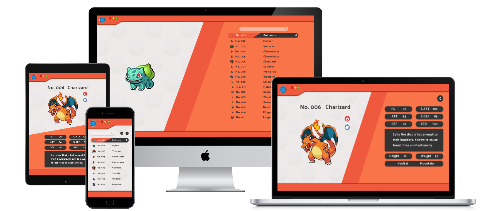

# Pokédex

Saludos entrenadores! 

Imagina un viaje alucinante, mezclando nostalgia y tecnología: ¡Crear una app inspirada en la Pokédex de la primera generación fue como lanzarse a una aventura Pokémon!

En ella podrás encontrar todos los pokémon de la primera generación y filtrarlos por nombre además de consultar sus estadísticas, tipos, descripción, habilidades...

¡Vuelve a tu infancia con los sonidos y el diseño fiel a la original, pero con un toque renovado! 🕹️

[Sitio Web](https://pokedex-complete.vercel.app/) 💻​

## Sobre el proyecto

* Diseñada con Figma para mejorar así la planificación de la App y poder comprender los datos necesarios y la manera más efectiva de representarlos, pudiendo mantener una coherencia visual y funcional en todo el desarrollo.

 

<iframe width="800" height="475" src="https://www.figma.com/embed?embed_host=share&url=https%3A%2F%2Fwww.figma.com%2Ffile%2Fd3Oh1efAhcHs2JiurehbVW%2FUntitled%3Ftype%3Ddesign%26node-id%3D0%253A1%26mode%3Ddesign%26t%3D1l5R1a1YXEQkcWoA-1" allowfullscreen></iframe>

 

* Desarrollado con Angular 16.2 pudiendo comprender así la estructura del framework, el uso de componentes y la gestión del estado de la aplicación.

 

* Integrada con la Api de [Pokémon](https://pokeapi.co/api/v2) de la cuál se obtienen todos los datos necesarios, a excepción de los sonidos, obtenidos de la Api de [Pokémon ShowDown](https://pokemonshowdown.com/)

 

* Diseñada de manera responsive, amigable y facilmente accesible desde multiples dispositivos. Cumpliendo criterios de accesibilidad para que pueda ser usada por culquier persona.

  
 

* Especial atención a la optimización para motores de búsqueda (SEO). Desde la estructura del código hasta la implementación de metaetiquetas relevantes.

## Tecnologías utilizadas
&nbsp;&nbsp;&nbsp;
&nbsp;&nbsp;&nbsp;
&nbsp;&nbsp;&nbsp;
&nbsp;&nbsp;&nbsp;